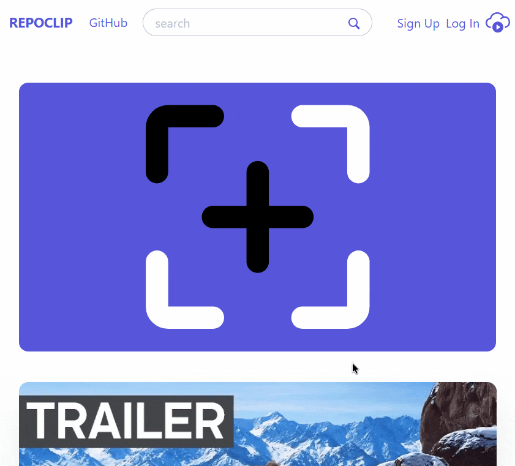

# RepoClip 🎬

**RepoClip is your streamlined platform to upload, share, and discover video clips. Passionately built with Ruby on Rails and Hotwire, RepoClip offers a smooth experience to showcase your favorite video moments. Explore, share, enjoy!**

[](https://repoclip.fly.dev/)<br>
*Please note: This is a live personal project. While content is monitored, you may encounter user-generated material. Inappropriate content will be removed promptly.*

<p align="center">
    
</p>

## About This Project

RepoClip was developed as a personal project to demonstrate full-stack web development capabilities using modern Ruby on Rails practices. The primary goal was to build a functional, user-friendly video sharing platform while deeply exploring technologies like:

*   Ruby on Rails 8.0.2
*   Hotwire (Stimulus & Turbo) for a dynamic and responsive frontend experience.
*   PostgreSQL for a robust database backend.
*   Active Storage for file uploads.
*   RSpec & Capybara for comprehensive testing.
*   Deployment on Fly.io.

This project showcases the ability to build, test, and deploy a real-world application from scratch.

## Features

RepoClip comes packed with features to enhance your video sharing and viewing experience:

*   **Comprehensive User Authentication:**
    *   User Registration & Secure Login
    *   Password Management (Change Password)
    *   "Forgot My Password" with Secure Password Reset Functionality
*   **Video Upload & Management:**
    *   Easy video file uploads
    *   Custom thumbnail uploads
    *   Client-side and server-side validations (file type, size)
*   **Video Discovery & Viewing:**
    *   **Video Search:** Quickly find videos by title or keywords.
    *   **Infinite Scrolling Gallery:** Seamlessly browse through videos on the index page, powered by Hotwire for a smooth experience.
    *   Dedicated video playback page with details.
*   **Community Interaction:**
    *   Commenting system on videos.
    *   **Share Video:** Easily copy a direct link to any video to your clipboard for sharing.

## Tech Stack

Key technologies and libraries used:

*   **Backend:** Ruby 3.4.x, Ruby on Rails 8.x, PostgreSQL
*   **Frontend:** Hotwire (Turbo, Stimulus), HTML5, CSS3 (Custom + Spectre.css), JavaScript (ES6+)
*   **File Storage:** Active Storage (Fly.io Volumes)
*   **Testing:** RSpec, Capybara, FactoryBot, Shoulda Matchers, Active Storage Validations
*   **Deployment:** Fly.io
*   **Version Control:** Git, GitHub

## Getting Started (Local Setup)

To get a local copy up and running, follow these simple steps.

### Prerequisites

Ensure you have the following installed on your development machine:

*   Ruby: Version `3.4.x`. Using `rbenv` or `asdf` is recommended.
*   Bundler: (`gem install bundler`)
*   PostgreSQL: A running local instance.
*   Git

### Installation

1.  **Clone the repository:**
    ```bash
    git clone https://github.com/santonero/repoclip.git
    cd repoclip
    ```

2.  **Install Ruby dependencies:**
    ```bash
    bundle install
    ```

3.  **Set up the database:**

    This project uses PostgreSQL for development.
    *   Ensure your local PostgreSQL server is running.
    *   Your local PostgreSQL user (typically your system username) should have privileges to create databases.

    Then, run:
    ```bash
    rails db:setup
    ```
    *(This command creates the database, loads the schema, and runs seeds if defined).*

    *Alternatively, for more granular control:*
    ```bash
    # rails db:create
    # rails db:migrate
    # rails db:seed
    ```

4.  **Start the Rails server:**
    ```bash
    rails server
    ```

5.  Open your browser and navigate to `http://localhost:3000`.

## Running Tests

To run the test suite:

```bash
# Run all RSpec tests
bundle exec rspec

# Run a specific file
# bundle exec rspec spec/models/video_spec.rb
```

## Deployment

This application is deployed on [Fly.io](https://fly.io/). Deployment is typically handled via the `fly deploy` command after initial setup on the Fly.io platform. Key configuration files for deployment include `fly.toml` and `Dockerfile`.

## License

Distributed under the MIT License. See `LICENSE.md` for more information.

## Contact

Alexandre Caruette-Teissier
*   Email: rbsanto@proton.me
*   LinkedIn: [Alexandre Caruette-Teissier](https://www.linkedin.com/in/alexandrecaruetteteissier)
*   GitHub Project: [RepoClip Repository](https://github.com/santonero/repoclip)